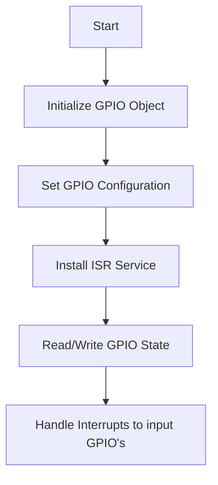

# GPIO Drivers

## Overview
The GPIO Drivers module provides functionalities to configure, control, and manage GPIO pins on the ESP32 microcontroller. It supports various GPIO modes, including input, output, and interrupt handling, with easy-to-use APIs for reading, writing, and toggling GPIO states.

## How It Works


## Workflow Description
1. **Initialize GPIO Object**: Create and initialize a gpio_t object to represent the GPIO.
2. **Set GPIO Configuration**: Configure the GPIO pin as input or output with optional pull-up/pull-down settings.
3. **Install ISR Service**: Enable the ISR service if interrupt handling is required.
4. **Read/Write GPIO State**: Use provided APIs to get the current state, set the state, or toggle the GPIO.
5. **Handle Interrupts**: Attach an ISR handler to respond to GPIO events (e.g., edge detection).

## External Dependencies
1. **ESP-IDF**: Provides the necessary libraries and tools for ESP32 development.
2. **GPIO Driver**: Handles low-level GPIO operations.

## How to Use
1. Include the GPIO Drivers module in your project by adding it to your CMakeLists.txt file:
    ```cmake
    idf_component_register(SRCS "your_code.c"
                        INCLUDE_DIRS "include"
                        REQUIRES gpio_drivers)
    ```
2. Define and initialize a gpio_t object in your application code:
```c
gpio_t my_gpio = {
    .pin = D13,  // GPIO pin number
    ._mode = GPIO_MODE_OUTPUT,  // Mode (input or output)
    ._act_state = GPIO_STATE_LOW,  // Initial state
};
gpio_init_impl(&my_gpio);
```
3. Use APIs to control or monitor the GPIO:
    - **Set State**: gpio_write(&my_gpio, GPIO_STATE_HIGH);
    - **Get State**: gpio_state_t state = gpio_read(&my_gpio);
    - **Toggle State**: gpio_toggle(&my_gpio);

## Configuration Details
1. **GPIO Pinout**: Predefined pin mappings are available in the gpio_pinout_t enumeration for easy reference.
2. **GPIO States**: Use GPIO_STATE_LOW or GPIO_STATE_HIGH to represent the state of a GPIO pin.
3. **Interrupt Configuration (For inputs)**: Attach ISR handlers when configuring GPIO pins as inputs:
    ```c
    // Input
    gpio_set_config_input(D13, my_isr_handler, D13);
    // Output
    gpio_set_config_output(D14);
    ```

## Example Usage
1. Configuring a GPIO Pin as Output:
    ```c
    gpio_set_config_output(D13);
    ```
2. Configuring a GPIO Pin as Input with ISR:
    ```c
    #include <stdint.h>

    uint32_t counter = 0;

    void my_isr_handler(void *args)
    {
      counter++;
    }

    gpio_set_config_input(D12, my_isr_handler, NULL);
    ```
    **Note**: NOT use log prints in ISR handlers for performance reasons.

3. Toggling a GPIO Pin State, in main execution:
    ```c
    gpio_toggle(&my_gpio);
    ESP_LOGI(TAG, "Counter: %d", counter);
    ```

## Notes
- Ensure the ISR service is installed before using interrupt-related functions.
- Use appropriate pull-up or pull-down settings based on your hardware requirements.
- Logs can be disabled or minimized for use in time-critical contexts.

## Future Implementations
1. Add support for advanced GPIO features like debounce filtering.
2. Provide examples for common use cases (e.g., button press detection).
3. Optimize ISR handler registration for high-performance applications.

## References
1. [ESP-IDF GPIO API](https://docs.espressif.com/projects/esp-idf/en/stable/esp32/api-reference/peripherals/gpio.html)
